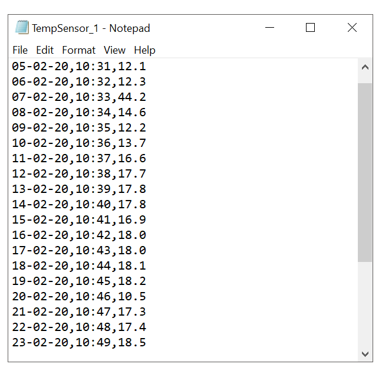
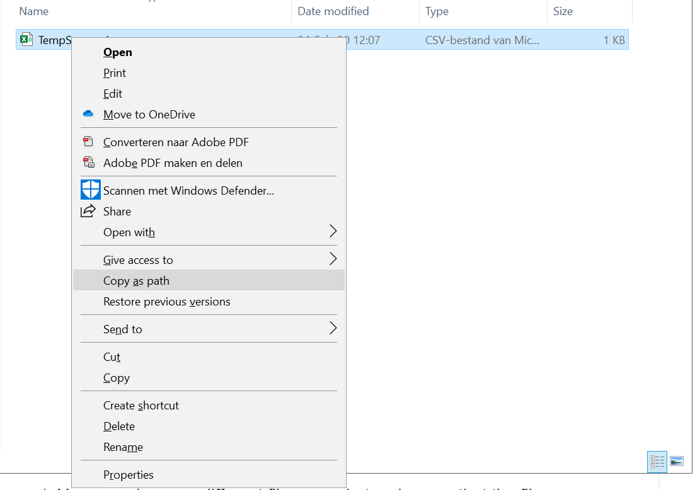

# Working with CSV files

## In this tutorial

In this tutorial we will discuss how you can use Python to work with CSV files. We we show how to read the data from these files, perform edits or store our results to them. To do so, we will use [Pandas](https://pandas.pydata.org/pandas-docs/version/0.15/tutorials.html). 

> ## What is a CSV file
> You might have worked with CSV files before, but it is important to realize how these files are build up. If you open a CSV file in Excel, you might not really notice a difference to .xls files. However, CSV files are unique in the sense that they are accesibile to almost any software package out there. The reason for this is that the file structure is very simple. If you open a CSV file in a simple text editor (e.g. notepad), you will notice that they consists of lines of information which is seperated by comma's, hence the name "Comma Seperated Values". Each line represents a data point and the values on that line is the information that we have on each case.
> 

## Reading a CSV file

First things first, you will need a csv file to read. You can download a practice file [here](https://raw.githubusercontent.com/MarjoleinHordijk/PythonTutorials/master/files/TempSensor_1.csv). This file contains some hypothetical data from a temperature sensor.

### 1. Find the path

Next, you will need to find out the path to the location where you stored the file. 

- Right click the .csv file while holding the shift key on your keyboard down.
- Chose "Copy as path" from the menu that appears.



- If you now paste the path you just copied into a text editor, you should see something as is shown below. This is the location that the .csv file is stored at on your harddrive.


### 2. Import the csv file

Now that we know where the .csv file is stored we can read it using pandas. Since pandas is a [module](01_05_Modules.md), we will first need to import it at the beginning of our script.

- Import the pandas module at the start of your script.

```python
import pandas as pd
```

- Now we will create a variable called df to store the information we get from the csv file.

Make sure you replace the path\to\file with your own file location.
Be aware of two things: 
1. You will need to use backward instead of forward slashes. Depending on your operating system, the path that you found may use forward slashes. In that case, you will need to adapt this.
2. You need to put the path between single quotes. Again, you might need to adap this if your operating system uses double quotes instead.

```python
import pandas as pd

df = pd.read_csv (r'path\to\file')
```

- Run this code (in this example we use Spyder to do so).

You will not see any output in the console. However, in the Variable Explorer tab in Spyder, you will see a new variable appear. If you double click this variable, you can see the data of the .csv file in a table format. 

You can also see the content of the df variable by running ```print(df)``` from the console.


> #### Dataframes
> We are using df as a name for our variable, since the resulting datatype will be a "DataFrame". This datatype is specific to pandas. It is basically a two dimensional table as we are used to seeing in Excel. The first row of the .csv file is interpreted as titles of the colomns. Therefore, we call this datastructure "labeled". 

### 3. Reading the data

We now have a variable that stores the data of our .csv file. However, we still need to access this data to use it in our script. Below several ways of accessing particular sections of this data are discussed.

#### Select a colomn

You can select a specific colomn using ```df['colomnlabel']``` or ```df.colomnlabel``` where "colomnlabel" refers to the title of the colomn. These titles are stored in the first row of the .csv file.


#### Select rows

You can also slide your data. That is, select only particular rows. Partitioning your data like this is sometimes required when using particular algorithms. For example, if you want to build a neural network you will need a training and validation dataset.

The code below partitions the dataset (which contains 28 cases) into two partitions. The first partition contains rows 1-20, the second one rows 21-28. Recall that Python starts counting at 0!

```python
import pandas as pd

df = pd.read_csv (r'path\to\file')

partition1 = df[0:19]
partition2 = df[20:27]
```