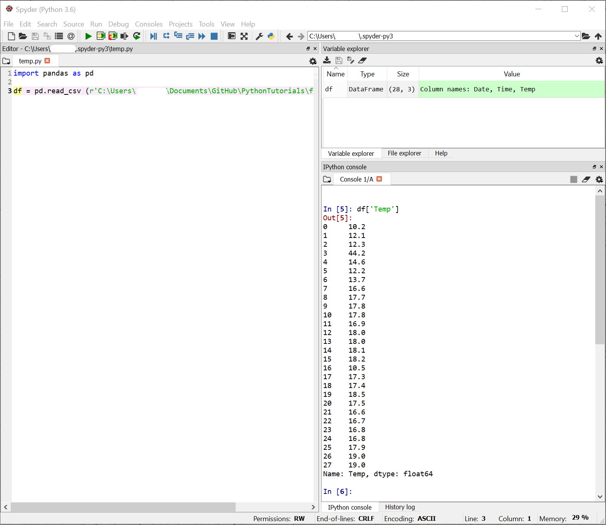
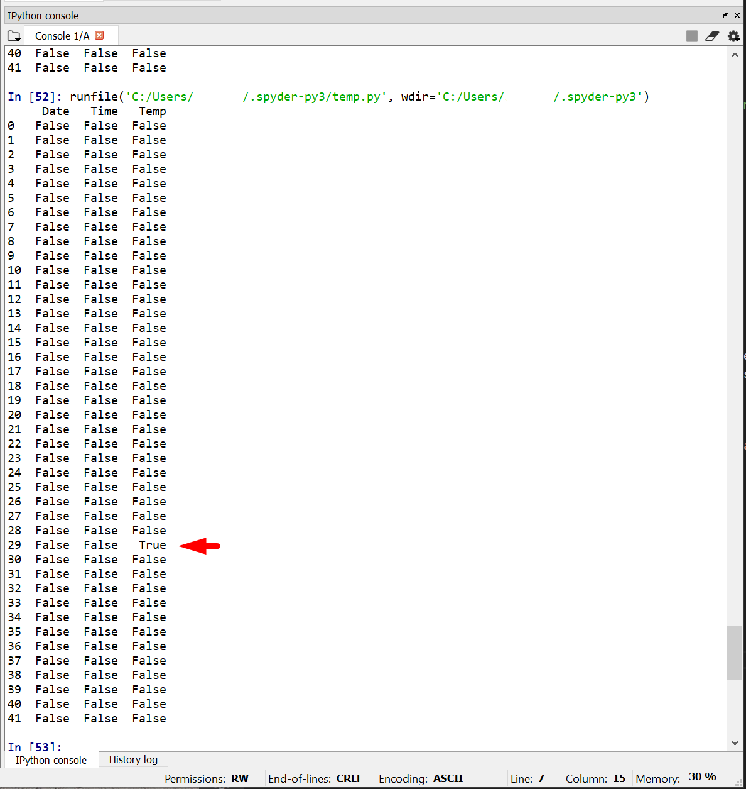

# Working with CSV files

## In this tutorial

In this tutorial we will discuss how you can use Python to work with CSV files. We we show how to read the data from these files, perform edits or store our results to them. To do so, we will use [Pandas](https://pandas.pydata.org/pandas-docs/version/0.15/tutorials.html). 

> ## What is a CSV file
> You might have worked with CSV files before, but it is important to realize how these files are build up. If you open a CSV file in Excel, you might not really notice a difference to .xls files. However, CSV files are unique in the sense that they are accesibile to almost any software package out there. The reason for this is that the file structure is very simple. If you open a CSV file in a simple text editor (e.g. notepad), you will notice that they consists of lines of information which is seperated by comma's, hence the name "Comma Seperated Values". Each line represents a data point and the values on that line is the information that we have on each case.
> 

## Reading a CSV file

First things first, you will need a csv file to read. You can download a practice file [here](https://raw.githubusercontent.com/MarjoleinHordijk/PythonTutorials/master/files/TempSensor_1.csv). This file contains some hypothetical data from a temperature sensor.

### 1. Find the path

Next, you will need to find out the path to the location where you stored the file. 

- Right click the .csv file while holding the shift key on your keyboard down.
- Chose "Copy as path" from the menu that appears.


- If you now paste the path you just copied into a text editor, you should see something as is shown below. This is the location that the .csv file is stored at on your harddrive.


### 2. Import the csv file

Now that we know where the .csv file is stored we can read it using pandas. Since pandas is a [module](02_01_Modules&Packages.md), we will first need to import it at the beginning of our script.

- Import the pandas module at the start of your script.

```python
import pandas as pd
```

- Now we will create a variable called df to store the information we get from the csv file.

Make sure you replace the path\to\file with your own file location.
Be aware of two things: 
1. You will need to use backward instead of forward slashes. Depending on your operating system, the path that you found may use forward slashes. In that case, you will need to adapt this.
2. You need to put the path between single quotes. Again, you might need to adap this if your operating system uses double quotes instead.

```python
import pandas as pd

df = pd.read_csv (r'path\to\file')
```

- Run this code (in this example we use Spyder to do so).

You will not see any output in the console. However, in the Variable Explorer tab in Spyder, you will see a new variable appear. If you double click this variable, you can see the data of the .csv file in a table format. 

You can also see the content of the df variable by running ```print(df)``` from the console.


## Reading data from dataframes

> #### Dataframes
> We are using df as a name for our variable, since the resulting datatype will be a "DataFrame". This datatype is specific to pandas. It is basically a two dimensional table as we are used to seeing in Excel. The first row of the .csv file is interpreted as titles of the colomns. Therefore, we call this datastructure "labeled". 

We now have a variable that stores the data of our .csv file. However, we still need to access this data to use it in our script. Below several ways of accessing particular sections of this data are discussed.

### Select a colomn

You can select a specific colomn using ```df['colomnlabel']``` or ```df.colomnlabel``` where "colomnlabel" refers to the title of the colomn. These titles are stored in the first row of the .csv file. Please note that "df" refers to the name that we gave to our DataFrame variable. If you used a different name to store the data, you will need to replace this.



### Select rows (partitioning)

You can also slide your data. That is, select only particular rows. Partitioning your data like this is sometimes required when using particular algorithms. For example, if you want to build a neural network you will need a training and validation dataset. Furthermore, when you are dealing with a very large dataset, it might be usefull to quickly view a section of it to get an idea of its content. (Instead you can also use ```df.head()``` or ```df.tail()``` to get the top or bottom five rows of the dataset.)

The code below partitions the dataset (which contains 28 cases) into two partitions. The first partition contains rows 1-20, the second one rows 21-28. Recall that Python indices start at 0!

```python
import pandas as pd

df = pd.read_csv (r'path\to\file')

partition1 = df[0:19]
partition2 = df[20:27]
```

### Getting a value

If you want to get a particlar value for a specific case you can do so in different ways. Depending on the structure of your script, one method might me more handy than the other.

```python
import pandas as pd

df = pd.read_csv (r'path\to\file')

# Get value by location in table.
# From the fifth record, store the value in the third colomn in val1.
# row index = 4, colomn index = 2

val1 = df.iloc[4, 2]

# Get value by position of row and name of colomn.
# From the fifth record, store the value in the colomn with label "Temp" in val2.

val2 = df.loc[4, 'Temp']

# Print the values
print (val1)
print (val2)

```

### Search colomn values / Filtering

It might be that you are interested in the values of specific cases. For example, you want to search your dataset for all records of a particular time. You will need to search the colomn containing the times of the records, identify the matching cases and report them.

```python
import pandas as pd

df = pd.read_csv (r'path\to\file')

# Get value of one colomn by searching another.
# Of record(s) from 10:34 (time) store the value in the colomn with label "Temp" in val3.

records = df.loc[df['Time'].isin(['10:56']), 'Temp']

# Print the cases
print (records)
```

As you will see when you run the code, only one record was taken at 10:34. The index of this record is 26 and the temperature at this time was 19.0 degrees.

If multiple records would have the value value in the "Time" colomn, a list of these records would have been reported. This is the case in the example below.

```python
import pandas as pd

df = pd.read_csv (r'path\to\file')

# Get value of one colomn by searching another.
# Of record(s) from 10:34 (time) store the value in the colomn with label "Temp" in val3.

records = df.loc[df['Time'].isin(['10:35']), 'Temp']

# Print the cases
print (records)
```

In this case, two records are returned.
- Index: 5, Temperature: 12.2
- Index: 30, Temperature: 18.5

## Identifying missing data

It is not uncommon for datasets to have missing data. In some cases, this is not an issue. However, some algorithms may have trouble dealing with this. In that case you will need to identify missing values and deal with the appropriately.

Missing data is usually indicated by ```NaN```. 

You can get an overview of missing data using pandas' ```isna()``` function, which returns a table-like output showing true if the value at that position is missing and false if it is not.

```python
import pandas as pd

df = pd.read_csv (r'path\to\file')

missing = pd.isna(df)
print(missing)
```
As you will see, for one record the temperature is missing. The index of this case is 29.



### Determine the percentage of missing data in a colomn

Let's say we would want to know now what percentage of data in the temperature colomn is missing. To do so, we can use the information that we stored in the "missing" variable. Why? Because the true/false values in this dataframe are boolean. This means that False evaluates to 0 and True evaluates as 1. Hence, we can simply ```sum``` all values in the "Temp" colomn of "missing" and find the total number of missing values.

To calculate the percentage, we will also need to know the total number of records. This can be done using ```len```, which determines the length of a dateframe (= the number of rows).

```python
import pandas as pd

df = pd.read_csv (r'path\to\file')

# Dataframe with true/fales to indicate missing values.
missing = pd.isna(df)

# Determine total number of records with missing values in "Temp" colomn.
missing_records = missing['Temp'].sum()

# Determine total number of records.
total_records = len(df)

# Determine percentage missing.
missing_percentage = missing_records / total_records

print("Records with missing date for Temp: " + str(missing_records))
print("Total number of records: " + str(total_records))
print("Percentage of missing records: " + str(missing_percentage))
```
