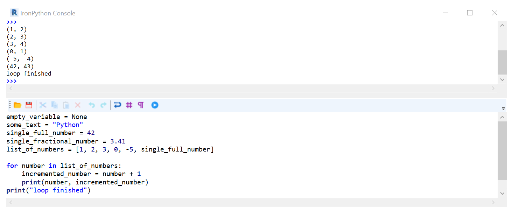
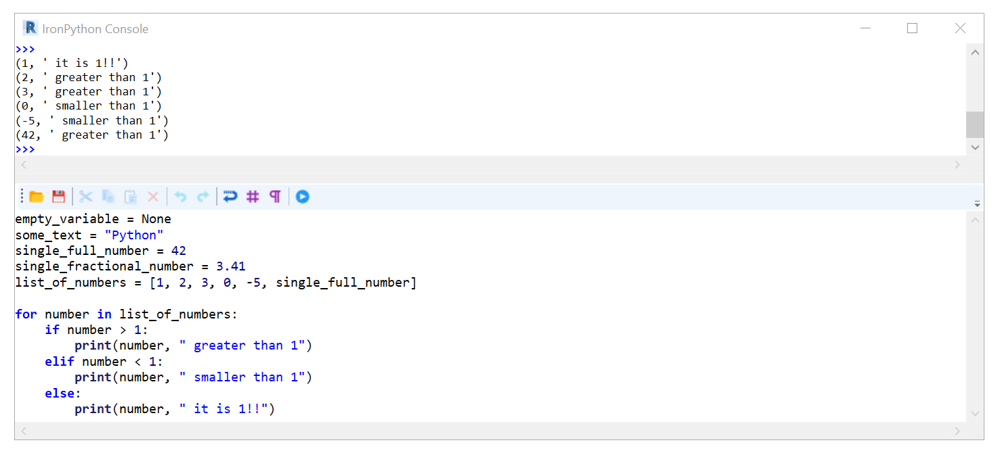
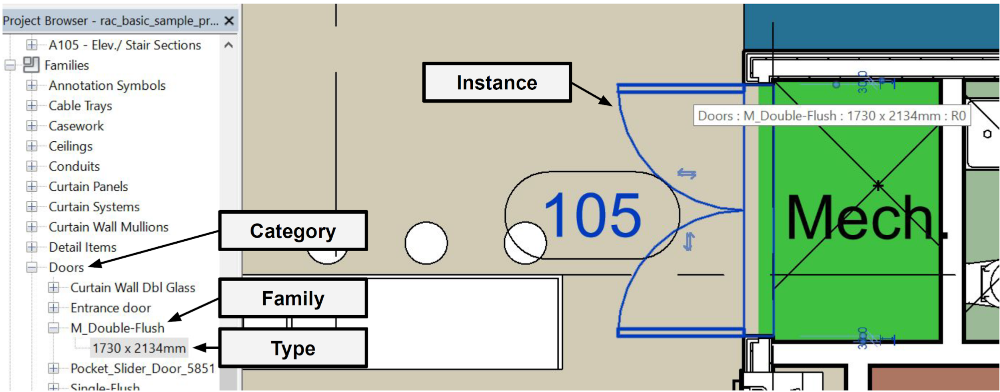
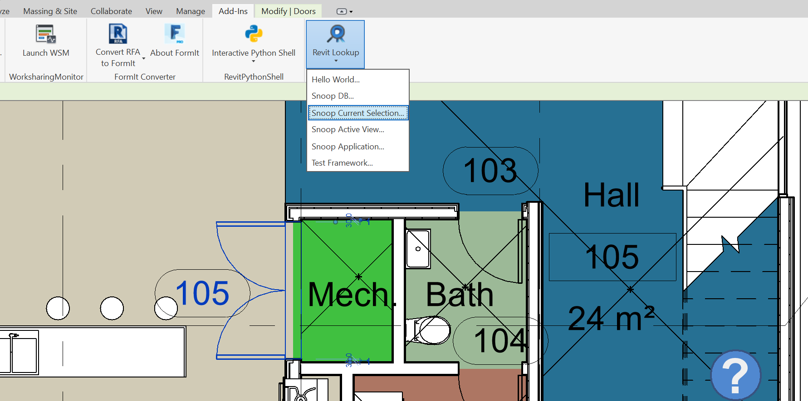
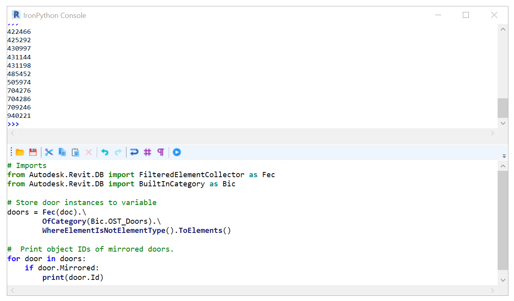
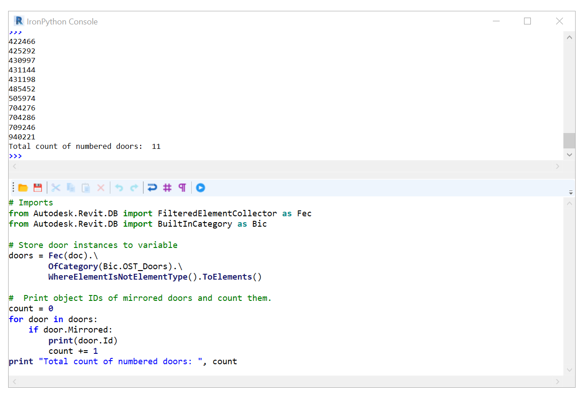
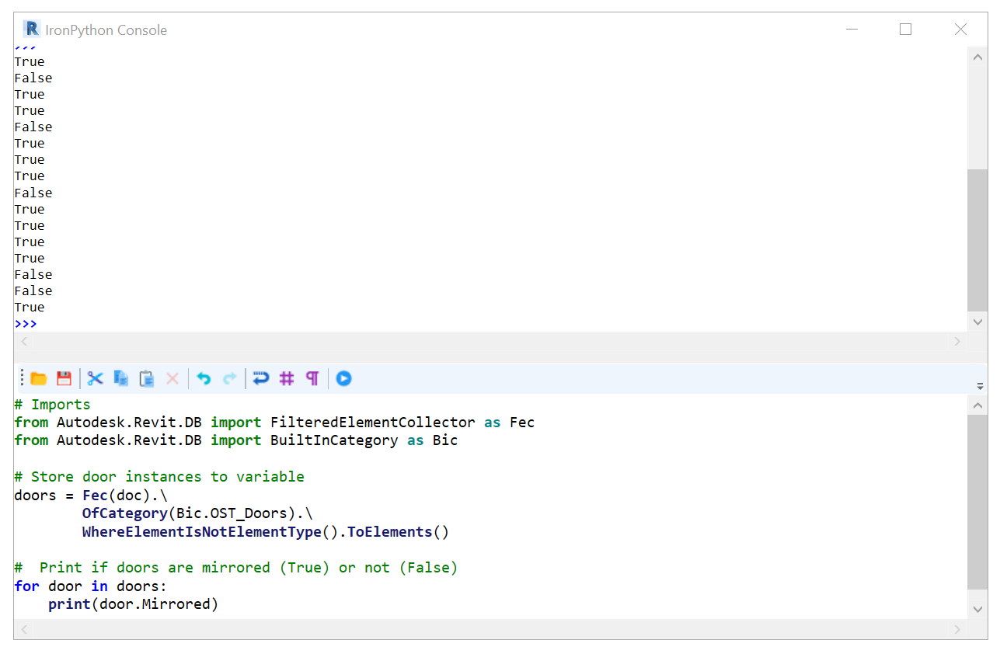
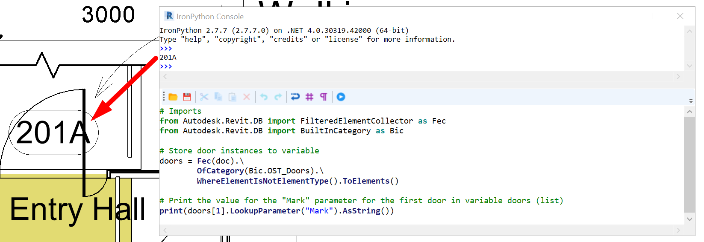
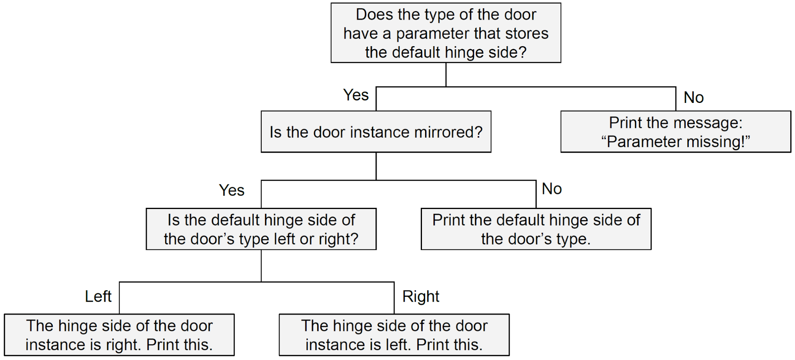

# Using the RevitPythonShell

## 1. What is RevitPythonShell?

Different from some of the other software packages addressed in this repository, Revit does not come with a Python console by default. However, the RevitPythonShell add-in can easily be installed to add this functionality. This allows you to develop custom Python script to analyse and alter your model. This tutorial is developed based on [these](https://github.com/hdm-dt-fb/bilt_academy_2019) instructions.

<span style="text-decoration:underline;">What we will discuss in this tutorial:</span>

In this tutorial we will focus on the very basic applications of the RevitPythonShell. You will learn how to query your model for specific objects and retrieve information about them. At the end, a more advanced example is included to demonstrate how this knowledge could be applied in practice. 

<span style="text-decoration:underline;">What you will need:</span>

You will need a recent version of Revit and the corresponding version of the RevitPythonShell add-in. This tutorial uses Revit 2018. You can download RevitPythonShell from [here](https://github.com/architecture-building-systems/revitpythonshell). You can use the basic architectural sample project in Revit to run the commands.


## 2. Using the RevitPythonShell

Once you have installed the RevitPythonShell, you will be able to find it under the “Add-ins” tab in Revit. 


The console that opens consists of two main parts. In the top part, you can type commands (e.g. `print("Hello world!)`). When you press enter, you will see the resulting output appear. However, we can also write snippets. That is, code blocks which we can store and share. This is done in the bottom part of the window. To run the code, simply press the play icon or hit F5 on your keyboard.


If you are familiar with Python already, you will be able to perform standard operations such as defining variables, writing loops, and using conditional statements. Some examples are provided below to illustrate that the same can be done within RevitPythonShell and to help you get familiar with the console.

**Variables**

We can create variables to store all kinds of data. For example, we can store text, numbers, lists, etc. This is no different from working with Python in any other console.


```
empty_variable = None
some_text = "Python"
single_full_number = 42
single_fractional_number = 3.41
list_of_numbers = [1, 2, 3, 0, -5, single_full_number]
```


As we will see later, we can also use variables to store references to objects in our Revit model and information related to those objects. As you may have anticipated, you can simply print this information using the `print()` function. 


```
print(empty_variable)
>> None

print(list_of_numbers)
>> [1, 2, 3, 0, -5, 42]
```


**Loops**

We can also use a loop to iterate through a list and apply an operation to each element one by one. For example, we could increment each value in the `list_of_numbers` variable by one as shown below.


```
for number in list_of_numbers:
    incremented_number = number + 1
    print(number, incremented_number)
print("loop finished")
```



**Conditional Statements**

We can also use conditional statements to process information retrieved from the model. For example, we can specify to perform a particular operation only if a certain condition is satisfied. To illustrate, we can print if a number in the `list_of_numbers` variable is below or above one using the following code.


```
for number in list_of_numbers:
    if number > 1:
        print(number, " greater than 1")
    elif number < 1:
        print(number, " smaller than 1")
    else:
        print(number, " it is 1!!")
```



The next section will show how we can use these operations to query the objects in a Revit model and analyse their information.


## 3. Querying Model Elements

There are several options to connect your script to the Revit model. We will discuss two options here. First, you are able to select model elements in the view and access them in your script. Alternatively, you can query elements in the model based on their category.

### 3.1 Accessing Selected Elements**

If you select one or multiple objects in the model view, you will be able to access and use them in your script. The selected objects are available as a list of elements stored in the variable `selection`. The first element of this list can be called by “s0”, the second by “s1” and so on. 

Select several elements in your model. If you now type “s0.” in your console window, you will notice that a substantive list of suggestions appears. These all concern operations that we could perform with the selected elements. However, we can also access specific information about each element. As an example, we will print the element Ids of the objects you selected. You can do so using the piece of code below.


```
for element in selection:
	print (element.Id)
```


You can check the Ids using the interface under Manage > Inquiry > IDs of Selection to compare.

## 3.1 Querying Elements on Category

We can use the `FilteredElementCollector` to access model elements based on their category or class. You can find a list of all build in categories [here](https://www.revitapidocs.com/2019/ba1c5b30-242f-5fdc-8ea9-ec3b61e6e722.htm). An example includes the doors (OST_Doors). These categories are also shown in your Project browser panel, as shown below.



We can store all door instances in the model to a variable (`doors`) as shown below.


```
from Autodesk.Revit.DB import FilteredElementCollector as Fec
from Autodesk.Revit.DB import BuiltInCategory as Bic

doors = Fec(doc).\
        OfCategory(Bic.OST_Doors).\
        WhereElementIsNotElementType().ToElements()
```


Notice that we imported `FilteredElementCollector` and `BuiltInCategory` under the names Fec and Bic to keep our code more condensed.  This is called aliasing.

We include `WhereElementIsNotElementType()`, since we are only interested in the door instances. If we would like to access the door types in the model we would use `WhereElementIsElementType()` instead, as shown below.


```
from Autodesk.Revit.DB import FilteredElementCollector as Fec
from Autodesk.Revit.DB import BuiltInCategory as Bic

doorTypes = Fec(doc).\
        OfCategory(Bic.OST_Doors).\
        WhereElementIsElementType().ToElements()
```


In the next section, we will discuss how you can read parameters and properties from these door instances that we have now identified.

## 4. Reading instance properties

Now that we have access to elements in our model, we can start reading the information about them. For example, we can print the object ids of the door instances in our model using a small for loop.


```
# Imports
from Autodesk.Revit.DB import FilteredElementCollector as Fec
from Autodesk.Revit.DB import BuiltInCategory as Bic

# Store door instances to variable
doors = Fec(doc).\
        OfCategory(Bic.OST_Doors).\
        WhereElementIsNotElementType().ToElements()

#  Print object IDs
for door in doors:
    print(door.Id)
```


If you are curious which properties and parameters apply to an instance in your model, there are handy tools available to look this up. RevitLookup can help you generate a such a list. A installer for this add-in is available [here](https://boostyourbim.wordpress.com/2017/04/28/revit-lookup-2018-install/). 

After installing, you will be able to access all the information you need regarding a selected instance. For example, in the image below a double flush door has been selected. If we “Snoop” the current selection, we will be able to see that this door instance has a property called “mirrored”, which is currently set to “false”.




We can also access this information for all doors in our model using the following piece of code.


```
# Imports
from Autodesk.Revit.DB import FilteredElementCollector as Fec
from Autodesk.Revit.DB import BuiltInCategory as Bic

# Store door instances to variable
doors = Fec(doc).\
        OfCategory(Bic.OST_Doors).\
        WhereElementIsNotElementType().ToElements()

#  Print if doors are mirrored (True) or not (False)
for door in doors:
    print(door.Mirrored)
```




We can also print the object IDs of only those doors that are mirrored using a conditional if statement.


```
# Imports
from Autodesk.Revit.DB import FilteredElementCollector as Fec
from Autodesk.Revit.DB import BuiltInCategory as Bic

# Store door instances to variable
doors = Fec(doc).\
        OfCategory(Bic.OST_Doors).\
        WhereElementIsNotElementType().ToElements()

#  Print object IDs of mirrored doors.
for door in doors:
    if door.Mirrored:
        print(door.Id)
```



We can even adapt this loop to determine the total number of doors that are mirrored in our model.


```
# Imports
from Autodesk.Revit.DB import FilteredElementCollector as Fec
from Autodesk.Revit.DB import BuiltInCategory as Bic

# Store door instances to variable
doors = Fec(doc).\
        OfCategory(Bic.OST_Doors).\
        WhereElementIsNotElementType().ToElements()

#  Print object IDs of mirrored doors and count them.
count = 0
for door in doors:
    if door.Mirrored:
        print(door.Id)
        count += 1
print(count)
```



## 5. Reading instance parameters

We can use the “LookupParameter(“parameter_name”)” method to look up **parameters** of an **instance**. However, this will only return the parameter itself, but not the value that is stored for it. To retrieve the value, we need to know the datatype of the parameter (e.g. integer or string). Usually, this is quite straightforward. For example, the “Mark” parameter is a string value. We can access and print this value for the first door in the variable `doors` as shown below.


```
# Imports
from Autodesk.Revit.DB import FilteredElementCollector as Fec
from Autodesk.Revit.DB import BuiltInCategory as Bic

# Store door instances to variable
doors = Fec(doc).\
        OfCategory(Bic.OST_Doors).\
        WhereElementIsNotElementType().ToElements()

# Print the value for the "Mark" parameter for the first door in variable doors (list)
print(doors[1].LookupParameter("Mark").AsString())
```



## 6. Reading type parameters

If you are familiar with Revit, you will know that a model instance (e.g door) belongs to a particular type that defines certain attributes of the object. We can also access the information regarding the type a specific instance belongs to. 

However, to retrieve **type parameters**, such as the name of the type, we need to add something extra.  In the RevitAPI the type of a Family is accessed by the property “Symbol”. Hence, we can retrieve this information using <code>door.<span style="text-decoration:underline;">Symbol</span>.LookupParameter()</code>, as shown below.


```
# Imports
from Autodesk.Revit.DB import FilteredElementCollector as Fec
from Autodesk.Revit.DB import BuiltInCategory as Bic

# Store door instances to variable
doors = Fec(doc).\
        OfCategory(Bic.OST_Doors).\
        WhereElementIsNotElementType().ToElements()

#  Print type names of door instances in model.
for door in doors:
    print(door.Symbol.LookupParameter("Type Name").AsString())
```


## 7. Exercise: Set Parameter Values Using a Script

In this exercise we will develop a small script to write parameter values. We will determine for each door the side of its hinges (left or right) based on the type of the door and whether it is mirrored or not. You can find the complete script at the end of this section. We will go through the build up of this script step by step below.

Note that not all door objects have the right properties for this script to work. Please use [this](https://github.com/hdm-dt-fb/bilt_academy_2019/blob/master/model/python_beginners_tower.rvt) model to test the code to make sure it will work properly.

We will start with some required **imports** and some **references**. These are required to interact with the currently opened model and access or alter the information of its elements. For example, we need to start a so called “transaction” to be able to edit the door hinge side information of the instances in the model.


```
# Imports
import clr
clr.AddReference("RevitAPI")
from Autodesk.Revit.DB import BuiltInCategory as Bic
from Autodesk.Revit.DB import FilteredElementCollector as Fec
from Autodesk.Revit.DB import Transaction

# reference to the current open revit model to work with:
doc = __revit__.ActiveUIDocument.Document

# parameter names to work with:
# these are just the parameter names so we can reference them later
# not the actual parameters or their values
family_hinges_side = "hinges_side_family"
instance_hinges_side = "hinges_side_instance"

# entering a transaction to the modify revit model database
# Start transaction
tx = Transaction(doc, 'set door hinges side')
tx.Start()
```


Next we create the variable `doors` to store the **door instances** in, as we did in earlier sections of this tutorial.


```
# connect to Revit model elements via FilteredElementCollector
# collect all the doors
doors = Fec(doc).OfCategory(Bic.OST_Doors).WhereElementIsNotElementType().ToElements()
```


In earlier sections, we looped through all door instances in the current model to retrieve particular information. In a similar manner, we can determine the **default hinge side of the door type** to which a door instance belongs using `door.Symbol.LookupParameter(family_hinges_side)`. Recall that `family_hinges_side` refers to the string `"hinges_side_family"` which is the name of the type parameter that stores the hinge side value which is default for that type of door.


```
for door in doors:
    print(35 * "-")
    print(door.Id)
    print(door.Symbol.LookupParameter(family_hinges_side).AsString())
```


However, we did not consider a situation where this <span style="text-decoration:underline;">information might be missing</span>. If this is the case, the script that we are now developing will crash. To avoid this we can **debug** using a simple conditional if statement. This piece of code ensures that if relevant information is missing, we can trace back the particular instance and fix the issue. That is, the door id will be printed followed by the message: “parameter missing!”. 


```
for door in doors:
    print(35 * "-")
    print(door.Id)

    hinges_default_param = door.Symbol.LookupParameter(family_hinges_side)

    if hinges_default_param:
        hinges_type_side = hinges_default_param.AsString()
        print("door default side: ", hinges_type_side)
    else:
        print("parameter missing!")
```

As you will notice when you run our code so far, one door has a missing value. Since we know the door id from the output we can identify this as the door with id number “347860”. After selecting the door based on its id (Revit > Manage > Inquiry > Select by Id) we can see that the door is a double leaf door. It is therefore not strange that this door does not have a hinge side property. Since we specified an else statement, our code will not crash because of a lack of this parameter.

We now know for each door if its type family has a default hinge side and what this side is (left or right). Next we need to know if the door instances that we have a family hinge side value for are **mirrored or not**. We can find this out from the `Mirrored` property, which either has `True` or `False` as its value. In the code below, we store this value to the variable `is_mirrored`, which we then print for each door that has a family hinge side value.


```
for door in doors:
    print(15*"-")
    print(door.Id)

    hinges_default_param = door.Symbol.LookupParameter(family_hinges_side)

    if hinges_default_param:
        hinges_type_side = hinges_default_param.AsString()
        print("door default side: ", hinges_type_side)
        is_mirrored = door.Mirrored
        print("door is mirrored : ", is_mirrored)
    else:
        print("parameter missing!!")
```


We now have all the information that we need to determine the hinge side of the door instance. That is, the default hinge side of the door type and whether a door is mirrored or not. 

If a door is not mirrored, the hinge side of the instance will simply correspond to that of the family. However, if the door is mirrored, we will need to reverse the side. To print the hinge side of the door instances in our model, we can therefore use the code below. 


```
for door in doors:
    print(15*"-")
    print(door.Id)

    hinges_default_param = door.Symbol.LookupParameter(family_hinges_side)

    if hinges_default_param:
        hinges_type_side = hinges_default_param.AsString()
        print("door default side: ", hinges_type_side)

        is_mirrored = door.Mirrored

        if not is_mirrored:
            print("door is not mirrored.")
            print("instance is:", hinges_type_side)

        elif is_mirrored:
            print("door is mirrored.")
            if hinges_type_side == "L":
                print("instance is: R")
            elif hinges_type_side == "R":
                print("instance is: L")
    else:
        print("parameter missing!")
```


Like before, the first if statement checks if the door type has a hinge side property. If this is the case, it will determine if the door is mirrored or not. A nested if statement defines that if the door is not mirrored (`if not is_mirrored:)`, the default hinge side of the type is printed. On the other hand, if the door is mirrored (`elif is_mirrored:)`, another if statement is used to take the opposite of the family hinge side.



Finally, we can use `.Set()` to set the hinge side parameter of each door correctly according to the information that we have gathered.

```
for door in doors:
    print(15*"-")
    print(door.Id)

    # get preset default_hinges_side door side
    hinges_default_param = door.Symbol.LookupParameter(family_hinges_side)

    if hinges_default_param:
        hinges_type_side = hinges_default_param.AsString()
        print("door default side: ", hinges_type_side)

        # ask if door is mirrored or not
        is_mirrored = door.Mirrored

        # perform some logic to find the actual hinges side
        if not is_mirrored:
            door.LookupParameter(instance_hinges_side).Set(hinges_type_side)
            print("door is not mirrored.")
            print("instance is:", hinges_type_side) 

        elif is_mirrored:
            print("door is mirrored.")
            if hinges_type_side == "L":
                door.LookupParameter(instance_hinges_side).Set("R")
                print("instance is: R")
            elif hinges_type_side == "R":
                door.LookupParameter(instance_hinges_side).Set("L")
                print("instance is: L")
    else:
        print("parameter missing!!")
```

We can commit the changes using `tx.Commit()`. Adding this finishes our script. The complete code is found below.


```
#Imports
import clr

clr.AddReference("RevitAPI")
from Autodesk.Revit.DB import BuiltInCategory as Bic
from Autodesk.Revit.DB import FilteredElementCollector as Fec
from Autodesk.Revit.DB import Transaction

# __window__.set_font_sizes(19)  # set bigger font in RPS
# reference the current open revit model to work with:
doc = __revit__.ActiveUIDocument.Document

# parameter names to work with:
# these are just the names not the actual parameters or their values
family_hinges_side = "hinges_side_family"
instance_hinges_side = "hinges_side_instance"

# connect to Revit model elements via FilteredElementCollector
# collect all the doors
doors = Fec(doc).OfCategory(Bic.OST_Doors).WhereElementIsNotElementType().ToElements()

# entering a transaction to the modify revit model database
# Start transaction
tx = Transaction(doc, 'set door hinges side')
tx.Start()

# main logic of script
for door in doors:
    print(15*"-")
    print(door.Id)

    # ask each door for its type
    # get preset default_hinges_side door side
    hinges_default_param = door.Symbol.LookupParameter(family_hinges_side)

    if hinges_default_param:
        hinges_type_side = hinges_default_param.AsString()
        print("door default side: ", hinges_type_side)

        # ask if door is mirrored or not
        is_mirrored = door.Mirrored

        # perform some logic to find the actual hinges side
        if not is_mirrored:
            door.LookupParameter(instance_hinges_side).Set(hinges_type_side)
            print("door is not mirrored.")
            print("instance is:", hinges_type_side) 

        elif is_mirrored:
            print("door is mirrored.")
            if hinges_type_side == "L":
                door.LookupParameter(instance_hinges_side).Set("R")
                print("instance is: R")
            elif hinges_type_side == "R":
                door.LookupParameter(instance_hinges_side).Set("L")
                print("instance is: L")
    else:
        print("parameter missing!!")

# commit the changes to the model database
# End transaction
tx.Commit()
print("successfully changed model")
```

